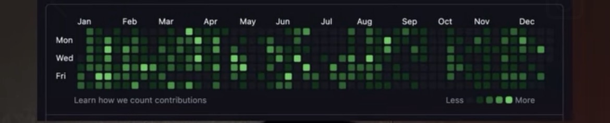

# Daily — Generated Contribution Art

This repository contains a generated 100-day sequence of dated commits created
as contribution-calendar art. Sixteen randomly selected dates are intentionally
blank; the remaining dates contain an artificially generated density of 15–50
commits. It does not represent product or project development work.

## Former account reference

The image below is an archived reference of the contribution calendar from my
former GitHub account. It is preserved here as a visual record and does not
represent contributions made in this repository.

